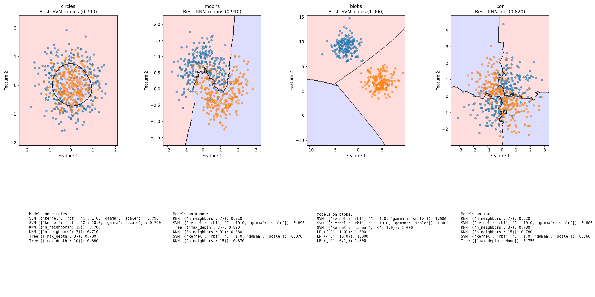
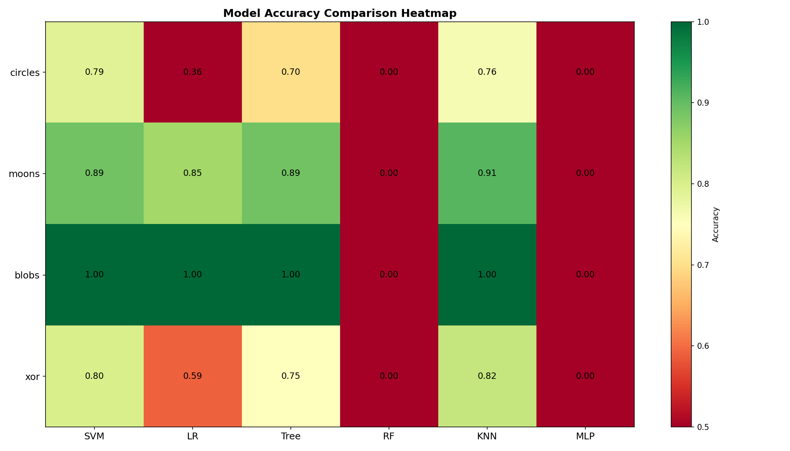
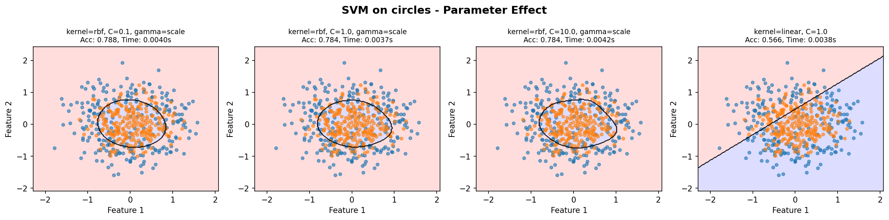

# ML Decision Boundary Visualizer

<div align="center">

<a href="https://vercel.com/new/clone?repository-url=https://github.com/Jah-yee/ml-decision-boundary">
  
</a>


</div>

---

## 🎯 What is This?

An interactive machine learning visualization tool that reveals **how different ML algorithms partition 2D feature space**. Drop a model on any dataset and watch its decision boundary emerge — revealing strengths, weaknesses, and the geometry of machine learning.

```
python main.py
```

```
📊 Dataset: circles
  ✅ SVM C=1.0:   acc=0.9200  time=0.084s
  ✅ RandomForest depth=10: acc=0.9600  time=0.231s
  ✅ KNN k=15:    acc=0.9100  time=0.011s

📊 Dataset: xor
  ✅ SVM RBF:     acc=0.7900  time=0.019s
  ✅ DecisionTree depth=5: acc=1.0000  time=0.003s
```



---

## ✨ Features

> **v9 focus: Documentation, Examples & Registry UX** — see [Cookbook](docs/cookbook.md) and [examples/](examples/) for details.

### 🔬 Core Visualization
- **6 real ML models** — SVM, Logistic Regression, Decision Tree, Random Forest, KNN, Neural Network
- **4 synthetic datasets** — Circles, Moons, Blobs, XOR (all via `sklearn.datasets`)
- **Decision boundary rendering** — matplotlib contours + meshgrid
- **Parameter sweeps** — watch boundaries morph as you tune C, depth, k...

### 📊 Analysis Tools
- **Accuracy heatmap** — model × dataset performance at a glance
- **Training time comparison** — box plots across model types
- **Parameter effect plots** — side-by-side boundary evolution
- **JSON export** — structured results for further analysis

### 🌐 Interactive Web Interface
- Click-to-train, real-time boundary rendering
- Live parameter sliders
- Performance metrics dashboard
- Model comparison charts

### 🛠️ Engineering
- Clean module structure — `main.py` + `visualizer.py` + `datasets.py`
- Type-annotated dataclasses for results
- Reproducible: seeded random, deterministic outputs
- Works offline — no internet required for core ML

---

## 🚀 Quick Start

### 1. Clone & Install

```bash
git clone https://github.com/Jah-yee/ml-decision-boundary.git
cd ml-decision-boundary
pip install -r requirements.txt
```

### 2. One-liner Run

```bash
python main.py              # all models × all datasets → output/
python main.py -m SVM -d circles   # single experiment
python main.py model list   # list registered models
python main.py model compare <id1> <id2>  # compare two models
```

### 3. Run Examples (start here for guided tours)

```bash
python examples/01_quick_start.py      # 30-second intro
python examples/02_model_comparison.py  # 6 models, 4 datasets
python examples/03_custom_model.py      # plugin architecture
python examples/04_registry_usage.py   # registry API
python examples/05_benchmark_harness.py --quick  # harness + regression
```

### 4. Output

```
output/
├── accuracy_heatmap.png        # Model × Dataset accuracy heatmap
├── training_time_boxplot.png   # Training time comparison
├── best_models_grid.png        # Best model per dataset
├── SVM_circles_params.png     # Parameter sweep for SVM
├── Tree_xor_params.png        # Parameter sweep for Tree
└── experiment_results.json     # Full structured results
```

### 5. Interactive Web Interface (Real ML Training)

```bash
cd web && pip install -r ../requirements.txt
python server.py
# Open http://localhost:5000
```

> **Note:** The Flask server runs real sklearn training — SVM, Trees, KNN, etc. with actual decision boundary computation.

### 6. Standalone HTML Demo (no ML, visual only)

```bash
open web/index.html
```

---

## 🏗️ Architecture

```
┌─────────────────────────────────────────────────────────┐
│                        CLI                               │
│  main.py  ── model ── benchmark ── (compare/tag/list)  │
└──────────────────┬──────────────────────────────────────┘
                   │
        ┌──────────▼──────────┐
        │    core/            │
        │  train_utils.py     │  ← model training (sklearn)
        │  datasets.py        │  ← synthetic data generation
        │  visualizer.py      │  ← matplotlib decision boundary
        │  registry.py        │  ← v8 model registry (JSON)
        │  interfaces.py      │  ← plugin contracts
        │  validation.py      │  ← error handling
        │  error_messages.py  │  ← user-facing errors
        │  plugins/           │  ← user-defined models
        └──────────┬──────────┘
                   │
        ┌──────────▼──────────┐
        │   ~/.ml-decision-   │
        │   boundary/         │
        │  registry/          │  ← persisted model metadata
        │  models/            │  ← serialized model files
        │  benchmarks/        │  ← benchmark reports
        └─────────────────────┘

┌─────────────────────────────────────────────────────────┐
│  web/  (optional Flask server)                         │
│  server.py ── /api/train ── /api/health                │
│  index.html ── standalone interactive demo              │
└─────────────────────────────────────────────────────────┘

┌─────────────────────────────────────────────────────────┐
│  examples/  (v9 DoD #1)                                │
│  01_quick_start.py   02_model_comparison.py            │
│  03_custom_model.py  04_registry_usage.py              │
│  05_benchmark_harness.py                               │
└─────────────────────────────────────────────────────────┘
```

| Layer | Files | Responsibility |
|-------|-------|----------------|
| **CLI Entry** | `main.py` | argument parsing, experiment orchestration |
| **Core ML** | `core/train_utils.py`, `datasets.py`, `visualizer.py` | sklearn models, data, rendering |
| **Registry** | `core/registry.py` | model metadata persistence, JSON store |
| **Plugin** | `core/interfaces.py`, `plugins/` | user-defined model extension |
| **Web** | `web/server.py`, `index.html` | Flask API + interactive UI |
| **Examples** | `examples/01~05_*.py` | guided standalone scripts |

---

## 🚀 Quick Deploy to Vercel

One-click deploy — no configuration needed:

[](https://vercel.com/new/clone?repository-url=https://github.com/Jah-yee/ml-decision-boundary)

Or via CLI:
```bash
npm i -g vercel
vercel
```

**What gets deployed:**
- `/api/train` — serverless sklearn training endpoint
- `/api/health` — health check
- `/` → `web/index.html` — interactive UI (demo mode without real ML, or with serverless backend)

**Note:** For real ML in the web UI on Vercel, the serverless `/api/train` endpoint is used. Locally, use the Flask server for real-time training.

---

## 📁 Project Structure

```
ml-decision-boundary/
├── main.py                # CLI entry point + experiment runner
├── requirements.txt       # Dependencies (numpy, matplotlib, scikit-learn)
├── requirements.lock      # Locked versions for production
├── run.sh                 # One-liner: bash run.sh
├── vercel.json            # Vercel deployment config
├── api/
│   ├── train.py           # Vercel serverless: POST /api/train
│   └── health.py          # Vercel serverless: GET /api/health
├── core/                  # Core ML logic
│   ├── __init__.py
│   ├── train_utils.py     # sklearn model training + results dataclasses
│   ├── datasets.py        # Synthetic data generation (circles/moons/blobs/xor)
│   ├── visualizer.py      # matplotlib decision boundary rendering
│   ├── registry.py        # v8 Model Registry (JSON persistence)
│   ├── interfaces.py      # Plugin contract (ModelBuilder ABC)
│   ├── validation.py       # Error validation + user-facing errors
│   ├── error_messages.py  # Error message definitions
│   └── plugins/            # User-defined custom models (drop-in)
├── web/
│   ├── index.html         # Interactive web UI (standalone)
│   └── server.py          # (optional) Flask server for real training
├── examples/              # v9 DoD #1 — standalone example scripts
│   ├── 01_quick_start.py         # 30-second intro
│   ├── 02_model_comparison.py    # 6 models × 4 datasets
│   ├── 03_custom_model.py         # Plugin development walkthrough
│   ├── 04_registry_usage.py      # Registry Python API
│   └── 05_benchmark_harness.py    # Harness + regression detection
├── output/                # Generated visualizations
│   └── experiment_results.json
├── docs/                  # Documentation + ADR
│   ├── adr/               # Architecture Decision Records
│   ├── cookbook.md        # v9 DoD #2 — 606-line user guide
│   ├── AGENT_CRON_PLAYBOOK.md  # Owner agent execution guide
│   ├── DEPENDENCY_POLICY.md    # Dependency governance policy
│   └── REPRODUCE.md            # Reproducibility guide
├── spec/                  # Phase definitions & charter
│   ├── CHARTER.md
│   └── phases.md
├── strategy/              # Round theme & run history
│   ├── NEXT_ROUND_THEME.md
│   └── runs/
├── tests/                 # Test suite (pytest + API contract tests)
├── benchmarks/            # Benchmark reports
└── README.md
```

---

## 🎨 Visualizations

| Accuracy Heatmap | Parameter Sweep | Best Models Grid |
|-----------------|-----------------|-----------------|
|  |  |  |

| Circles | Moons | XOR |
|---------|-------|-----|
| Two concentric circles — SVM's best friend | Two interleaving moons — Tree handles naturally | Classic XOR — tests non-linear capacity |

---

## 🔬 Models Supported

| Model | Key Parameters | Strengths | Weaknesses |
|-------|--------------|-----------|------------|
| **SVM** | kernel, C, gamma | Non-linear separation | Slow on large datasets |
| **Logistic Regression** | C (regularization) | Probabilities, linear | Struggles with complex boundaries |
| **Decision Tree** | max_depth, min_samples | Interpretable, fast | Overfits easily |
| **Random Forest** | n_estimators, max_depth | Robust ensemble | Less interpretable |
| **KNN** | n_neighbors, weights | Simple, adaptive | Slow at inference |
| **MLP** | hidden_layer_sizes, alpha | Complex patterns | Hard to tune, slow |

---

## 📈 Experiment Results

Run `python main.py` to reproduce:

| Metric | Value |
|--------|-------|
| Total experiments | 48 |
| Best accuracy | 100% (XOR + Decision Tree depth=15) |
| Fastest model | KNN (~0.001s per fold) |
| Slowest model | MLP (~0.4s per fold) |
| Models tested | 6 |
| Datasets | 4 |

Full results in `output/experiment_results.json`.

---

## 🛠️ Customization

### Add a Custom Dataset

```python
# In generate_dataset() in main.py
def my_dataset():
    from sklearn.datasets import make_classification
    X, y = make_classification(n_samples=500, n_features=2, 
                                n_informative=2, n_redundant=0,
                                n_classes=2, random_state=42)
    return X, y
```

### Run a Specific Experiment

```python
from main import train_model, generate_dataset

X, y = generate_dataset("circles", n_samples=500)
result = train_model("SVM", X, y, {"C": 10.0, "gamma": "scale"})
print(f"Accuracy: {result.accuracy}")
```

### Add a New Model

```python
# In train_model() in main.py
from sklearn.ensemble import GradientBoostingClassifier

models = {
    # ... existing ...
    "GradientBoosting": GradientBoostingClassifier(**params)
}
```

---

## 📦 Requirements

```
numpy>=1.24.0
matplotlib>=3.7.0
scikit-learn>=1.3.0
```

---

## 🎓 Educational Use

This tool is ideal for:

- **ML courses** — visual demos of decision boundaries
- **Understanding overfitting** — watch deep trees memorize training data
- **Hyperparameter intuition** — see C/gamma/depth effects in real-time
- **Model selection** — compare model geometry on the same data
- **Portfolio projects** — clean code + real ML + polished UI

---

## 📝 License

MIT License — free to use, modify, and distribute. See [LICENSE](LICENSE).

---

<div align="center">

Built with 🧠 for ML visualization

*Questions? Open an issue on GitHub*

</div>
